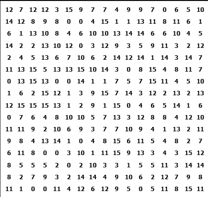

# Dominosa solver


Dominosa is a logic puzzle with the following rules:
- There's a grid of numbers from 0 to n
- Each number appears exactly n+2 times
- The goal is to connect these numbers into pairs (dominos) so that: 
    - Ech number is used exactly once
    - Each possible pair of numbers is found exactly once

It can be found on this [site](https://www.puzzle-dominosa.com/)

## Solver
I implemented a solver for this puzzle which utilizes only strategies that are viable to be found by humans, so there is no trial and error. This of course doesn't guarantee (at least I don't think) that the solver will find a solution to all possible dominosa puzzles however puzzles available online are usually designed to be solvable without utilizing backtracking. The whole thing is written with performance in mind, utilizing queues, hashmaps and utilizing the Graph class from python [igraph](https://python.igraph.org/en/stable/) package.
Techniques used range from simple (like choosing the pairs with only one possible place or tiles who can connect to only one of their neighbors) to more advanced (like finding articulation points in the graph or technique similar to disjoint groups in sudoku)

## OCR from image
I also implemented a script that takes a screenshot of a file provided by the user and tries to identify the whole board. To achieve perfect accuracy I implemented it as a 2 step process. First there is thresholding and dilation to identify the bounding boxes of the numbers which are then clustered by rows and columns and the noise is eliminated. The second part consists of cutting a fragment of the image around each bounding box and passing it to easyOCR recognizer which identifies the numbers.

Although this procedure works for the examples provided in the repo, it's not guaranteed to suceed always so there is also an option to provide a csv file with a board. (And to make this csv file one can use a decent LLM like Gemini in my case)

## Running
1. Install the requirements
```bash
pip install -r requirements.txt
```
2. Run main.py (use --logs to see the whole solution process)
```bash
python run main.py filename="images/1.png" --logs
```